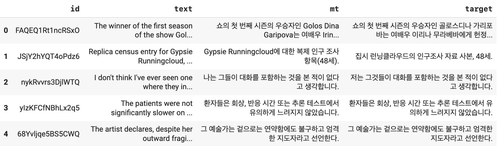
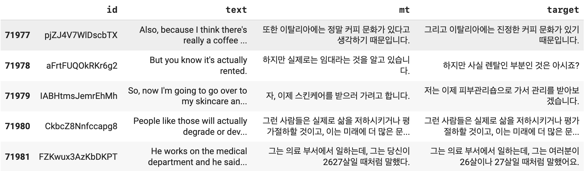
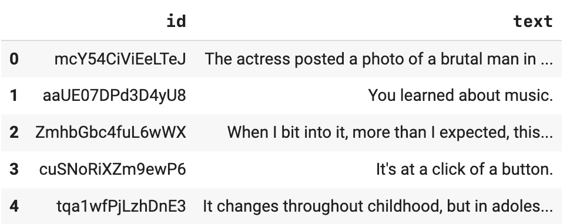
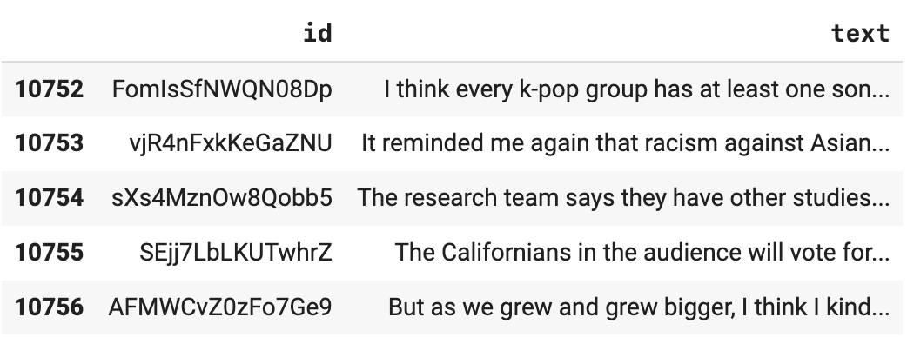
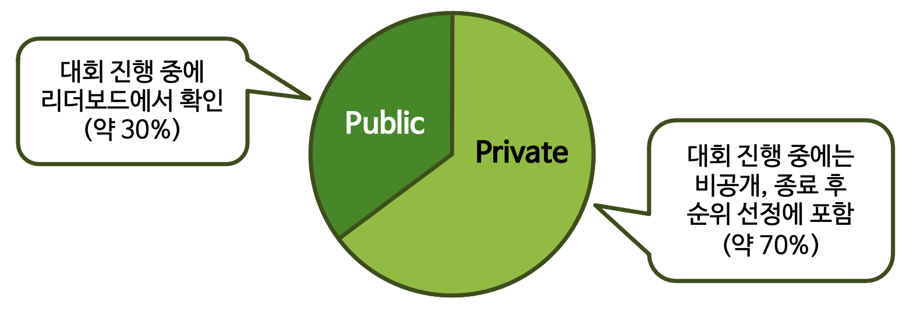
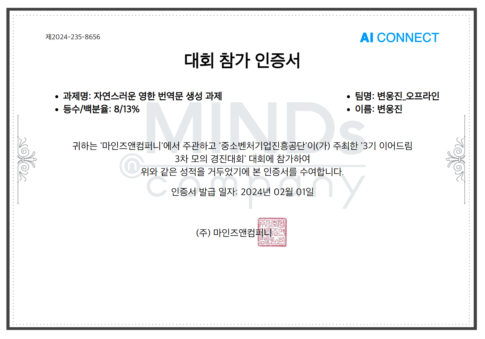
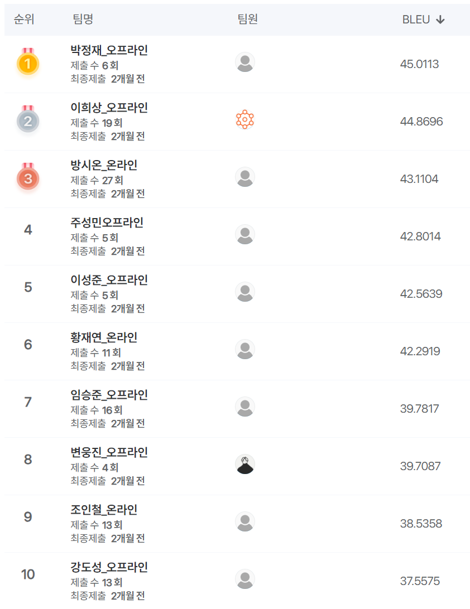

# 자연스러운 번역문 생성
"AI Connect 모의경진대회" 

보다 자연스러운 기계 번역문을 생성하기 위한 영한번역 및 사후교정 문제

**주최**: 중소벤처기업진흥공단

**주관**: 마인즈앤컴퍼니 (AI Connect)

<br>

## OverView

### 대회소개:

보다 자연스러운 기계 번역문을 생성하기 위한 영한번역 및 사후교정 문제

**제한사항**: 외부데이터 사용불가

**참여기간**: 2023.10.30 ~ 11.03

**참여방식**: 개인

<br>

## 데이터
- input : 영어 문장 (7만여건)
- output : 한국어 문장 (1만여건)

### 데이터 설명

**train.csv**
- id: 식별부호
- test: 영어원문
- mt: 기계번역 한국어
- target: 번역가가 자연스럽게 교정한 한국어

<p align='center'></p>

<p align='center'></p>

**test.csv**

<p align='center'></p>

**sample_submission.csv** 

<p align='center'></p>

<br>

## 평가지표

- 평가지표: BLEU Score (Bi-Lingual Evaluation Understudy) 기계 번역 결과와 사람이 번역한 참조 번역 간의 유사성을 측정하는 방법입니다.

- BLEU Score는 크게 두 가지 요소를 고려합니다:

    - N-gram 정확도: 이는 기계 번역과 참조 번역 간에 얼마나 많은 N-gram(연속된 단어 또는 토큰의 시퀀)이 일치하는지를 측정합니다. N은 일반적으로 1에서 4까지의 값을 가집니다.

    - 짧은 문장 패널티: 이는 기계 번역이 너무 짧은 문장을 생성하여 N-gram 정확도를 높이려는 시도를 패널티 부여를 합니다.

- BLEU Score는 0에서 1 사이의 값을 가집니다. 값이 1에 가까울수록 기계 번역 결과가 참조 번역과 매우 유사하다는 것을 의미합니다. 그러나 BLEU Score는 번역의 전체적인 품질만을 반영할 뿐, 문맥적인 정확성이나 번역의 유창성 등은 반영하지 않습니다.

<br>

$$ \textrm{Unigram Precision} \ P = \frac{m}{w_t} \ \ \ ⟶ \textrm{n-gram 정밀도} $$

<br>

$$ \textrm{where} 
\begin{cases} 
m: \textrm{number of tokens both in reference and predition} \\ 
w_t: \textrm{number of tokens in prediction} 
\end{cases} 
$$

<br>

$$ 
\textrm{Brevity penalty }p 
\begin{cases} 
1 \ \ \ \ \ \ \ \ \ \ \ \textrm{ if } \ c > r  \\
e^{(1-\frac{r}{c})} \ \ \ \textrm{ if } \ c ≦ r 
\end{cases} 
⟶ \textrm{길이 패널티} 
$$  

<br>

$$ ⟹ \textrm{BLUE} = p⋅e^{\Sigma^n_{n=1}(\frac{1}{N}\log⋅P_n)}\textrm{ where } N = 4 $$

- 정밀도의 geometric mean + 길이 페널티 (best score = 100.0)

<br>

- 리더보드 테스트 데이터 분할
<p align='center'></p>

<br>

## 번역기술 탐색

### HuggingFace Pipeline
처음 시도해본 모델은 **m2m100**으로 주로 번역 작업을 위한 다국어 인코더-디코더(seq-to-seq)모델이며 오픈소스로 제공하며 가장쉽게 사용할 수 있는 방법은 허깅페이스의 파이프라인을 사용하는 것 입니다. 

HuggingFace의 Pipeline은 모델에서의 전처리, 후처리, 추론과정을 묶어 하나의 함수로 제공하는 기능을 하기에 매우 편리하게 사용할 수 있었습니다.

```python
from transformers import pipeline
from sacrebleu.metrics import BLEU

pipe = pipeline(task='text2text-generation', model='facebook/m2m100_418M', device=0)

pred = pipe(list(train_df.loc[:5,'text']), forced_bos_token_id=pipe.tokenizer.get_lang_id(lang='ko'))

print('original text:', train_df.loc[0,'text'])
print('target:',train_df.loc[0,'target'])
print('prediction:',pred[0]['generated_text'])

bleu = BLEU(trg_lang='ko')
print(bleu.corpus_score([r['generated_text'] for r in pred], [list(train_df.loc[:5,'target'])]).score)
```
```
original text: The winner of the first season of the show GolosDina Garipova sings a song from the film Carnival in a program dedicated to actress Irina Murav'eva.
target: 쇼의 첫 번째 시즌의 우승자인 골로스디나 가리포바는 여배우 이리나 무라베바에게 헌정된 프로그램에서 영화 카니발의 노래를 부릅니다.
prediction: 쇼의 첫 번째 시즌의 우승자 GolosDina Garipova는 영화 카니발에서 여배우 Irina Murav'eva에 전념하는 프로그램에서 노래를 부릅니다.
BLUE score: 26.35921813968538
```
<br>


이후 HuggingFace에서 오픈소스로 제공하는 여러 영한번역(english to korean)모델들을 찾아 시도해보았습니다.

```python
pipe = pipeline("translation", model="sungmogi/en2ko_hiphop_small-100", device='cuda', src_lang='en', tgt_lang='ko', max_length=512)

pred = pipe(list(train_df.loc[:5,'text']))
print('original text:', train_df.loc[0,'text'])
print('target:',train_df.loc[0,'target'])
print('prediction:',pred[0]['translation_text'])

bleu = BLEU(trg_lang='ko')
print(f"BLUE score: {bleu.corpus_score([r['translation_text'] for r in pred], [list(train_df.loc[:5,'target'])]).score}")
```
```
original text: The winner of the first season of the show GolosDina Garipova sings a song from the film Carnival in a program dedicated to actress Irina Murav'eva.
target: 쇼의 첫 번째 시즌의 우승자인 골로스디나 가리포바는 여배우 이리나 무라베바에게 헌정된 프로그램에서 영화 카니발의 노래를 부릅니다.
prediction: 쇼의 첫 시즌의 수상자, GolosDina Garipova는 여배우 Irina Murav'ev에게 바치는 프로그램에서 영화 Carnival에서 노래를 불러
BLUE score: 9.793252905434562
```
<br>

```python
pipe = pipeline("translation", model="KETI-AIR-Downstream/long-ke-t5-base-translation-aihub-en2ko", device='cuda', src_lang='en', tgt_lang='ko', max_length=512)

pred = pipe(list(train_df.loc[:5,'text']))
print('original text:', train_df.loc[0,'text'])
print('target:',train_df.loc[0,'target'])
print('prediction:',pred[0]['translation_text'])

bleu = BLEU(trg_lang='ko')
print(f"BLUE score: {bleu.corpus_score([r['translation_text'] for r in pred], [list(train_df.loc[:5,'target'])]).score}")
```
```
original text: The winner of the first season of the show GolosDina Garipova sings a song from the film Carnival in a program dedicated to actress Irina Murav'eva.
target: 쇼의 첫 번째 시즌의 우승자인 골로스디나 가리포바는 여배우 이리나 무라베바에게 헌정된 프로그램에서 영화 카니발의 노래를 부릅니다.
prediction: 이번 쇼의 첫 시즌 우승자 골로스디나 가리포바는 여배우 이리나 무라브'에바에게 바치는 프로그램에서 영화 카니발 노래를 부르며, 올로스디나 가리포바는 여배우 올로스디나 가리포바의 1기 시즌 우승자가 영화 '카니발'의 노래를 부른다.
BLUE score: 21.035823575458114
```
<br>

```python
pipe = pipeline("translation", model="NHNDQ/nllb-finetuned-en2ko", device='cuda', src_lang="en", tgt_lang="ko", max_length=512)

pred = pipe(list(train_df.loc[:5,'text']))
print('original text:', train_df.loc[0,'text'])
print('target:', train_df.loc[0,'target'])
print('prediction:', pred[0]['translation_text'])

bleu = BLEU(trg_lang='ko')
print(f"BLUE score: {bleu.corpus_score([r['translation_text'] for r in pred], [list(train_df.loc[:5,'target'])]).score}")
```

```
original text: The winner of the first season of the show GolosDina Garipova sings a song from the film Carnival in a program dedicated to actress Irina Murav'eva.
target: 쇼의 첫 번째 시즌의 우승자인 골로스디나 가리포바는 여배우 이리나 무라베바에게 헌정된 프로그램에서 영화 카니발의 노래를 부릅니다.
prediction: ko1 시즌 우승자 GolosDina Garipova는 영화 카니발의 노래를 여배우 Irina Murav'eva를 위한 프로그램에서 부른다.
BLUE score: 36.8210818605552
```

- device=0 를 으로 설정한 이유는 CPU가 아니라 GPU를 이용해서 모델을 실행시키기 위함입니다(device='cuda'로도 사용가능).

- 입력 언어는 영어이므로 src_lang(source language)은 eng_Latn(English Latin)으로 지정하고, 출력 언어는 한국어이므로 tgt_lang(target language)는 kor_Hang(Korean Hangul)로 설정하는것으로 보통 알고있었스나 허깅페이스 사용법으로는 'en', 과 'ko' 언급되어 이데로 사용했습니다.

- 아래 사용될 NLLB등의 모델은 512 토큰 이하의 데이터셋으로 학습되었기 때문에 이것보다 더 긴 내용의 입력이 들어오면 번역 품질이 저하될 수 있습니다. 그러므로 max_length=512 설정했습니다.


<br>

## 모델선정 및 허깅페이스 파이프라인 추론

이외 시도해본 모델이 더 많았지만 가장 성능이 좋게 나오는 모델은 Meta에서 개발된 NLLB라는 다국어지원 번역모델를 영한번역으로 파인튜닝한 바로 위 코드에서 보여지는 모델이었습니다.

NLLB가 제공하는 모델의 크기는 600M, 1.3B, 3.3B가 있고 이 중 600M과 1.3B는 경량화(Distilled)된 모델이며, 1.3B 모델을 사용해 보려고 했지만 코랩 무료버전으로는 리소스의 한계가 있어 600M을 사용하게 되었습니다.

일종의 하이퍼파라미터 튜닝으로 고유명사가 영어로 번역되는 부분을 고쳐 한글로 표현하게 해서 샘플에 대한 blue score가 높아지는 것을 확인 했습니다.

```python
pipe = pipeline("translation", model="NHNDQ/nllb-finetuned-en2ko", device='cuda', src_lang="en", tgt_lang="kor_Hang", max_length=512)

pred = pipe(list(train_df.loc[:5,'text']))
print('original text:', train_df.loc[0,'text'])
print('target:', train_df.loc[0,'target'])
print('prediction:', pred[0]['translation_text'])

bleu = BLEU(trg_lang='ko')
print(f"BLUE score: {bleu.corpus_score([r['translation_text'] for r in pred], [list(train_df.loc[:5,'target'])]).score}")
```
```
original text: The winner of the first season of the show GolosDina Garipova sings a song from the film Carnival in a program dedicated to actress Irina Murav'eva.
target: 쇼의 첫 번째 시즌의 우승자인 골로스디나 가리포바는 여배우 이리나 무라베바에게 헌정된 프로그램에서 영화 카니발의 노래를 부릅니다.
prediction: 쇼 첫 시즌의 우승자 골로스디나 가리포바는 영화 카니발의 노래를 여배우 이리나 무라브에바를 위한 프로그램에서 부른다.
BLUE score: 50.146331652329806
```

하지만 이것은 특정 샘플에 대한 편향이었다는 것을 알게되었습니다. 

<br>

## 결과

64명 인원 중 8위를 달성했으며

대회 최고 점수는 BLUE: 45.0113 이며, 달성한 점수는 BLUE: 39.7087 이었습니다.

<p align='center'></p>


## 한계점 및 회고

- 허깅페이스에 올려진 기존 모델들을 사용해, 직접 주어진 데이터를 학습하지 않고 추론만을 통한 시도는 명백히 한계가 있다는 것을 다시한번 확인했습니다.

- 평가 시 특정 샘플만을 보고서 섣부른 판단을 내리고 모델에 대한 성능을 확인했던 것도 문제가 있었습니다.

- 상위에 랭크된 점수를 얻는 방법들은 모두 주어진 데이터를 직접 파인튜닝해서 오랜시간 혼련을 시켜 결과를 제출한 사람들이 었습니다.